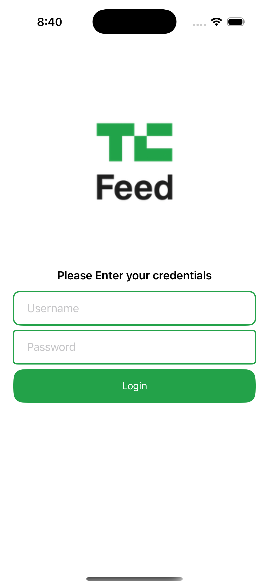
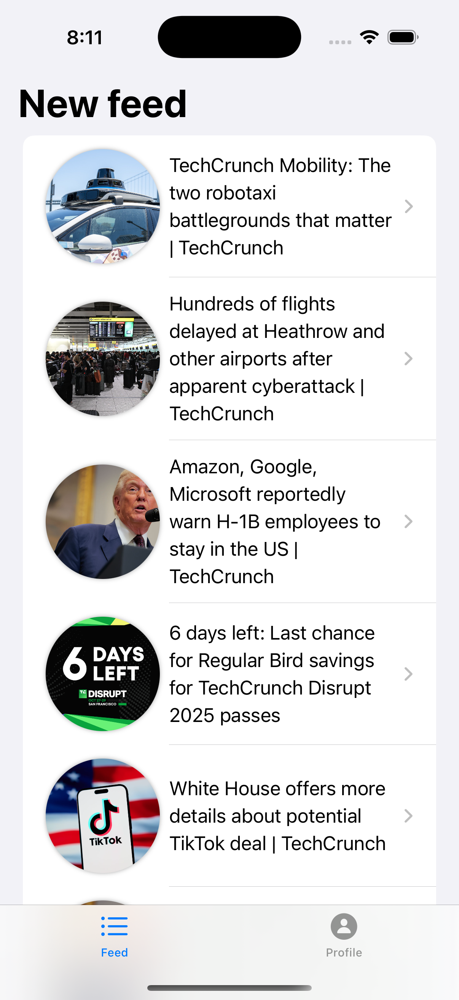
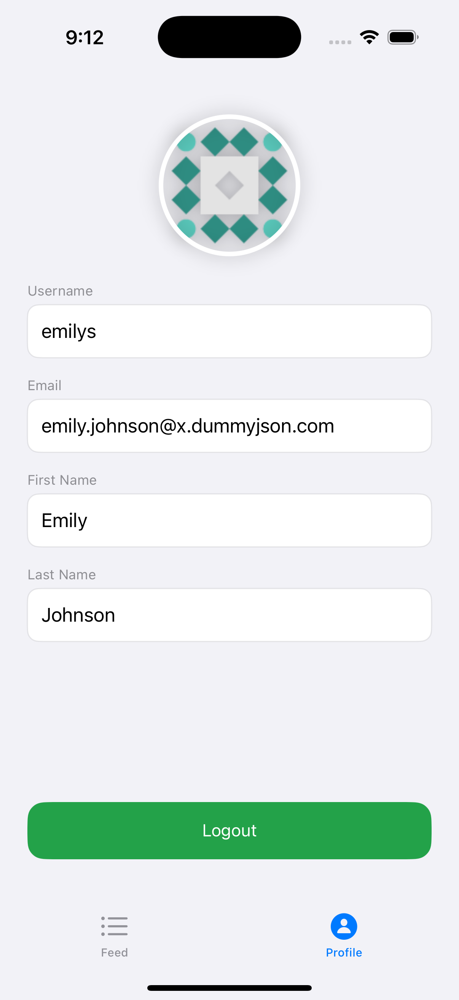

# PostsApp

A modular SwiftUI application demonstrating clean architecture, feature reusability, and separation of concerns.

---

## 📱 Screenshots

<!-- Add screenshots of your app below. Example: -->
| Login Screen | Feed Screen | Profile Screen |
|--------------|-------------|---------------|
|  |  |  |

*Place your screenshots in a `screenshots/` folder and update the paths above.*

---

## 📝 Project Description

PostsApp is a SwiftUI-based iOS application built with a modular architecture. Each feature (Login, Feed, Profile) is separated into its own module for maintainability and reusability. The Core module provides shared state, error handling, and utilities. The main app composes these modules and manages navigation and dependencies.

---

## 📦 Project Structure

```
PostsApp/
│
├── Core/                # Shared models, state, error handling, utilities
├── FeedFeature/         # Feed listing and details
├── LoginFeature/        # Login flow
├── ProfileFeature/      # User profile
├── PostsApp/            # App composition, DI, navigation, assets
├── Pods/                # External dependencies (Alamofire, SDWebImage, etc.)
├── build/               # Build artifacts
├── fastlane/            # CI/CD scripts
├── vendor/              # Third-party code
├── PostsApp.xcodeproj/  # Xcode project
├── PostsApp.xcworkspace # Xcode workspace
└── README.md            # Project documentation
```

---

## 🌳 Full Project Tree

```text
PostsApp
├── Core
│   ├── AppState.swift
│   ├── ContentState.swift
│   ├── NetworkError.swift
│   ├── Utilities
│   └── Core.docc
├── FeedFeature
│   ├── Sources
│   └── FeedFeature.docc
├── LoginFeature
│   ├── LoginModel.swift
│   ├── LoginProvider.swift
│   ├── LoginService.swift
│   ├── LoginView.swift
│   ├── LoginViewModel.swift
│   └── LoginFeature.docc
├── ProfileFeature
│   ├── ProfileUser.swift
│   ├── ProfileView.swift
│   └── ProfileFeature.docc
├── PostsApp
│   ├── AppDI.swift
│   ├── KeyChainHelper.swift
│   ├── PostsAppApp.swift
│   ├── RootView.swift
│   ├── Assets.xcassets
│   ├── Feed
│   ├── Feed.xcdatamodeld
│   ├── Preview Content
│   └── Info.plist
├── Pods
│   ├── Alamofire
│   ├── SDWebImage
│   ├── SDWebImageSwiftUI
│   └── ...
├── build
├── fastlane
├── vendor
├── PostsApp.xcodeproj
├── PostsApp.xcworkspace
└── README.md
```

---

## 🧩 Module Usage & Reusability

- **Core**: Import in any feature for shared state, error handling, and utilities.
- **FeedFeature**: Use `FeedView` and `FeedViewModel` for feed UI and logic.
- **LoginFeature**: Use `LoginView` with a `LoginProvider` for login UI.
- **ProfileFeature**: Use `ProfileView` with a `ProfileUser` model.
- **PostsApp**: Composes features, manages navigation, and dependency injection.

---

## 🚀 Getting Started

```swift
import LoginFeature

let provider = LoginProvider(
    viewModel: LoginViewModel(LoginService(), onLoginSuccess: { user in
        // Handle login success
    }),
    loginViewImage: Image("login_bg", bundle: .main)
)

LoginView(provider: provider)
    .environmentObject(appState)
```

---

## 📖 Documentation

- Each module contains a `.docc` folder with markdown documentation.
- See `Core/Core.docc/Core.md`, `FeedFeature/FeedFeature.docc/FeedFeature.md`, etc.

---

**This structure enables easy feature reuse, testability, and clean separation of concerns.**  
For more details, see the documentation in each module.

---
